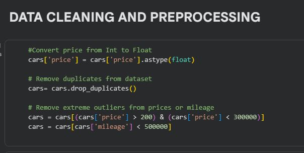
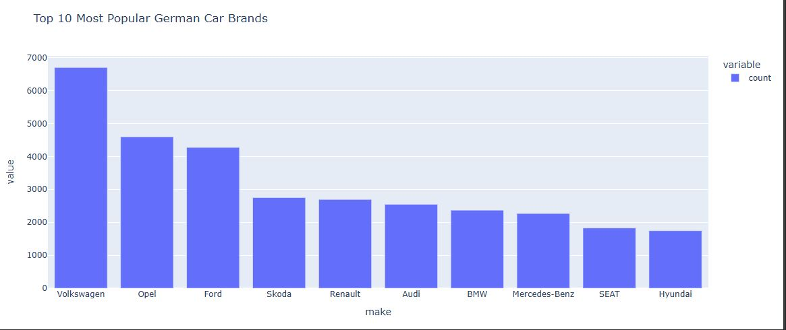
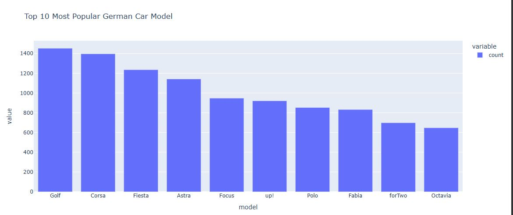
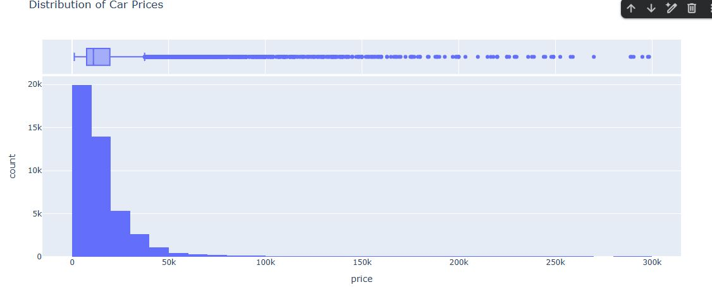
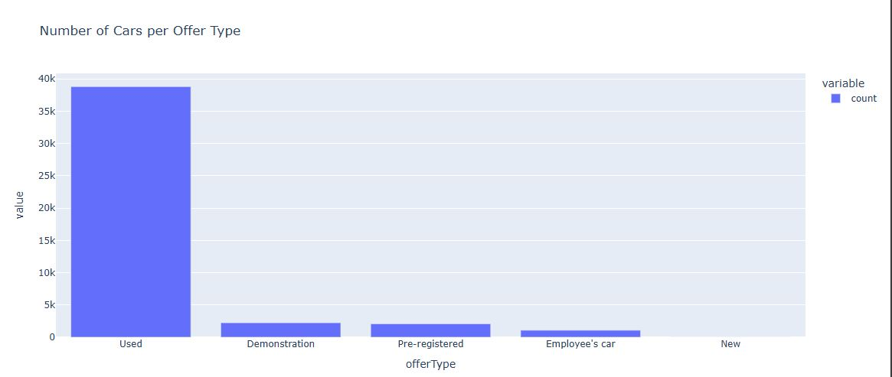
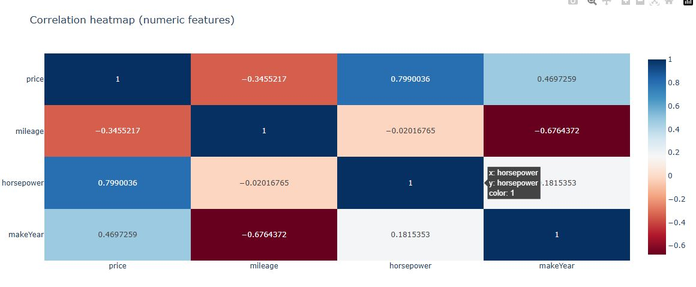

# 🚗💨 USED-CAR MARKET (GERMANY DATASET)

A comprehensive analytical dashboard developed in Python using Pandas, Plotly, Matplotlib, and ipywidgets, designed to simplify and enhance exploration of the Autoscout24 Germany car dataset through interactive visualizations, KPI cards, data cleaning workflows, and dynamic insights into market pricing, mileage trends, gear-type proportions, and brand popularity.

---

## 📝 Project Description

This project analyzes the Autoscout24 Germany used-car dataset to uncover insights about price behavior, vehicle features, brand popularity, and buyer trends.
It uses interactive visualizations, KPI cards, and widgets to create a dashboard-style exploratory data analysis.

---

## 🚀 Key Features
- Data cleaning & preprocessing  
- Numerical and categorical KPI cards  
- Interactive widgets  
- Plotly visualizations  
- Dashboard-style exploratory data analysis  
- Quantity, distribution, proportion, and relationship charts

---

## ⚙️ Setup Instructions
 Install dependencies:
     ```bash
    pip install pandas, numpy, matplotlib, seaborn ,plotly ipywidgets

## ⚙️How to Run the Analysis
 - Using Google Colab (Recommended)
 - Upload the dataset and script
 - Enable widget support:
  
 - Run all cells.

## 🔐 Key questions addressed:
- What is the average price, mileage, and horsepower of used cars?
- Which car makes and models are most popular?
- How does price vary by year, mileage, and horsepower?
- What proportion of cars use manual, automatic, or semi-automatic?
- Which year and model appear most frequently in the dataset?

## 📁 Included Files

### **Main Analysis**

[Raw Dataset](autoscout24-germany-raw_dataset.csv)

[Jupiter Notebook]([used_car_Project.ipynb](https://colab.research.google.com/github/AKINSOPE001/USED_CAR_GERMANDATASET/blob/main/used_car_Project.ipynb))
  Auto-generated JSON Based script from the Colab notebook containing:
  - Data cleaning steps  
  - KPI calculations  
  - Plotly visualizations  
  - Interactive widgets  
  - Exploratory Data Analysis  

[Cleaned Dataset](cleaned_germancars_dataset.csv) *(generated during analysis)*  
  Preprocessed dataset after:
  - removing duplicates  
  - cleaning price column  
  - filtering unrealistic values  
  - filling missing values  

 [Power Point Presentation](GermanCars_REDI_IdowuAkinsope.pdf) 
  PowerPoint summarizing:
  - KPIs  
  - Key charts  
  - Findings  
  - Recommendations  

---

## 📸 Screenshots
### 🧾KPI CARDS


### 🧾DATA CLEANING



### 🧾 QUANTITY VISUALISATION



### 🧾 DISTRIBUTION VISUALISATION




### 🧾 PROPORTION VISUALISATION


### 🧾 RELATIONSHIP VISUALISATION



### 📚 References
The following resources helped guide data cleaning, visualization design, and dashboard structuring:

Dataset Source

Autoscout24 Germany Used Cars Dataset

Python Libraries


General EDA Guidelines

Google Developers: Data Cleaning Fundamentals

Towards Data Science: EDA Best Practices Articles

Plotly Dashboards Tutorials on Plotly.com

## 🤝 Acknowledgements

   ReDI School Teachers and mentors

   This project was inspired by the following YouTube tutorial:

   - [Car Sales Analysis Complete Project in Power BI](https://www.youtube.com/watch?v=N2sr4ngDl78) by **PianalytiX**

> Special thanks for the step-by-step walkthrough that helped shape this project.

  ChatGPT for assistance in design, debugging, and documentation


## 🧪 Technologies Used:
This project was developed using Python in the Google Colab environment, leveraging libraries such as Pandas and NumPy for data cleaning and preprocessing, Matplotlib, Seaborn, and Plotly Express for interactive and static visualizations, and Ipywidgets for building interactive dashboards with dropdowns and KPI cards. The dataset consisted of German used-car listings with features including make, model, year, mileage, horsepower, fuel type, gear, and price. Markdown and HTML were used to document insights and display dashboard elements, enabling a clear and interactive exploration of the German used-car market.


              Developed by Akinsope Idowu, ReDI School Data Analytics student (WINTER 2025)

